**\# TensorFlow object detection - TFOD**

This project works on object detection based on pre-trained TensorFlow
models - taking customized dataset and identifies the type of each card.

We take a total of 6 different objects:

\- King

\- Queen

\- Nine

\- Ten

\- Jack

\- Ace

Dataset consists of images split between test and train data, each image
has a corresponding xml file containing annotations. (PASCAL VOC format)

**Training steps:**

Since there are xml files for each image we will aggregate these xml
files into a single csv file.

We use a pre-trained model provided by TensorFlow.

labelmap.pbtxt - This file contains the classes with their id's in json
format.

Pretrained model - faster\_rcnn\_inceptionv3\_coco.

Configuration file for this pretrained model, we make necessary changes
like the path, num of classes and fine\_tune\_checkpoint.

**Object detection**:

These are some libraries are used for detection:

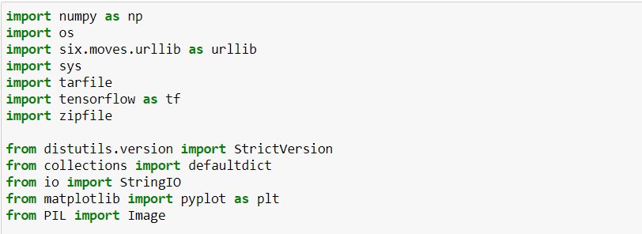

This repository contains a number of different models implemented in
\[TensorFlow\](https://www.tensorflow.org):

The \[official models\](official) are a collection of example models
that use TensorFlow's high-level APIs. They are intended to be
well-maintained, tested, and kept up to date with the latest stable
TensorFlow API. They should also be reasonably optimized for fast
performance while still being easy to read. We especially recommend
newer TensorFlow users to start here.

The \[research
models\](https://github.com/tensorflow/models/tree/master/research) are
a large collection of models implemented in TensorFlow by researchers.
They are not officially supported or available in release branches; it
is up to the individual researchers to maintain the models and/or
provide support on issues and pull requests.

How to setup TFOD in local system

Download require files to setup out TFOD

[https:**//**github.com**/**tensorflow**/**models**/**tree**/**v1.13.0](https://github.com/tensorflow/models/tree/v1.13.0)

[http:**//**download.tensorflow.org**/**models**/**object\_detection**/**faster\_rcnn\_inception\_v2\_coco\_2018\_01\_28.tar.gz](http://download.tensorflow.org/models/object_detection/faster_rcnn_inception_v2_coco_2018_01_28.tar.gz)

[https:**//**drive.google.com**/**file**/**d**/**12F5oGAuQg7qBM\_267TCMt\_rlorV-M7gf**/**view?usp=sharing](https://drive.google.com/file/d/12F5oGAuQg7qBM_267TCMt_rlorV-M7gf/view?usp=sharing)

[https:**//**github.com**/**tensorflow**/**models**/**blob**/**master**/**research**/**object\_detection**/**g3doc**/**tf1\_detection\_zoo.md](https://github.com/tensorflow/models/blob/master/research/object_detection/g3doc/tf1_detection_zoo.md)

create env

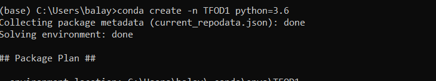

Once activate env just paste following link in env

pip **install** pillow lxml Cython contextlib2 jupyter matplotlib pandas
opencv-python tensorflow==1.14.0

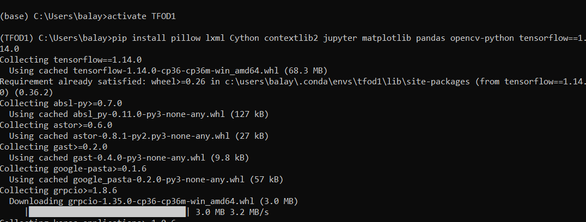

Set up research folder as root directory, it’s located inside models
file

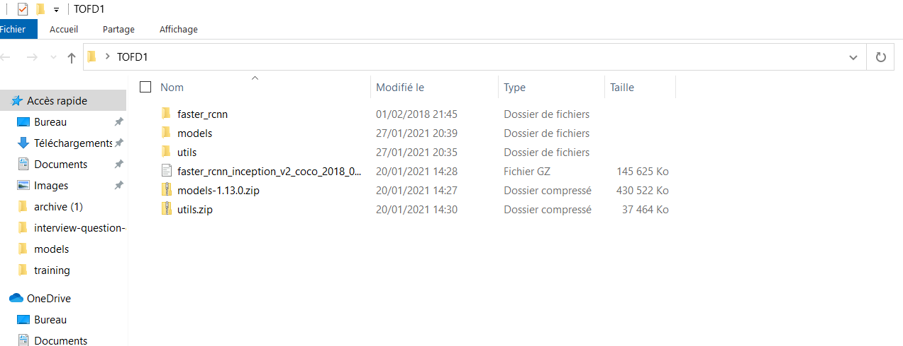

After install setup file inside research folder

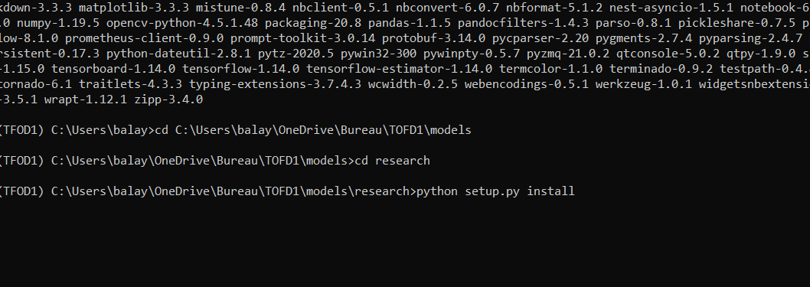

Once successfully installed above command then need to be installed
protobuf(buffer language inter changeable one language to another lang)

conda **install** -c anaconda protobuf

then excute this one helps to convert proto into python

protoc object\_detection**/**protos**/\***.proto --python\_out=.

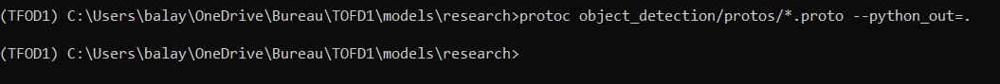

Copy .ipynb file from object\_detection folder into research folder
then,Open jupyter notebook from conda

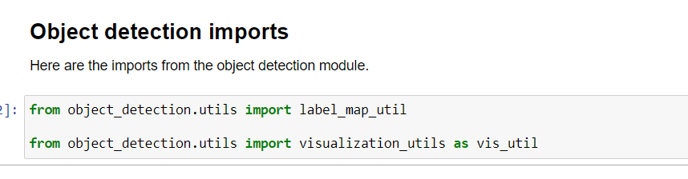

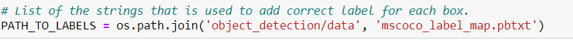

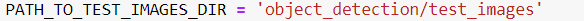

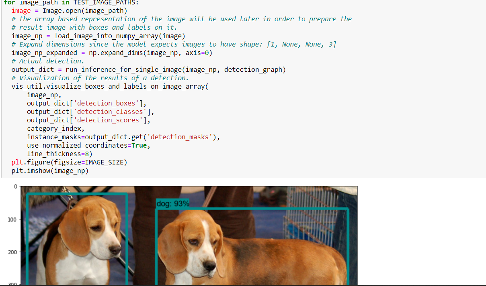

Finished with predefind one

Now we’re gonna take custom dataset

\#\# 2

\#\#\# Download dataset from google drive

In train folder there are around 2700 images and corresponding xml files
(annotations) PASCAL VOC format

In test folder as well.

For annotations used labelimg

Open utiles folder and copy all the all files and paste in research
folder

Create a single csv file for all the xmls files

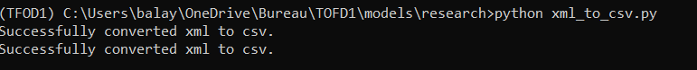

Csv to tfrecordes

1.  python generate\_tfrecord.py
    > --csv\_input=images**/**train\_labels.csv
    > --image\_dir=images**/**train --output\_path=train.record

2.  python generate\_tfrecord.py
    > --csv\_input=images**/**test\_labels.csv
    > --image\_dir=images**/test** --output\_path=test.record

move faster\_rcnn folder into research

move the configfile into training in research folder

C:\\Users\\balay\\OneDrive\\Bureau\\TOFD1\\models\\research\\object\_detection\\samples\\configs

Faster\_rcnn\_inception\_v2\_coco\_config(should check the model that we
have downloaded

Then open config file modify classes and path.

Copy train.py from below path and paste in research

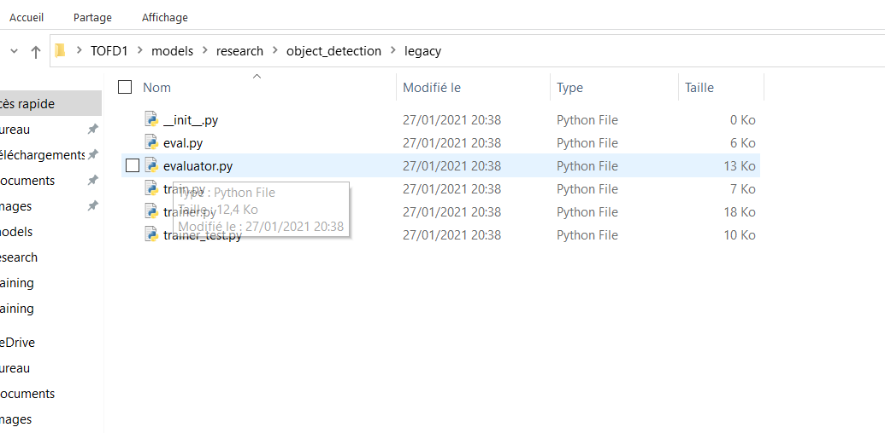

Run this code

python train.py --logtostderr --train\_dir=training**/**
--pipeline\_config\_path=training**/**faster\_rcnn\_inception\_v2\_coco.config

the error will get like this

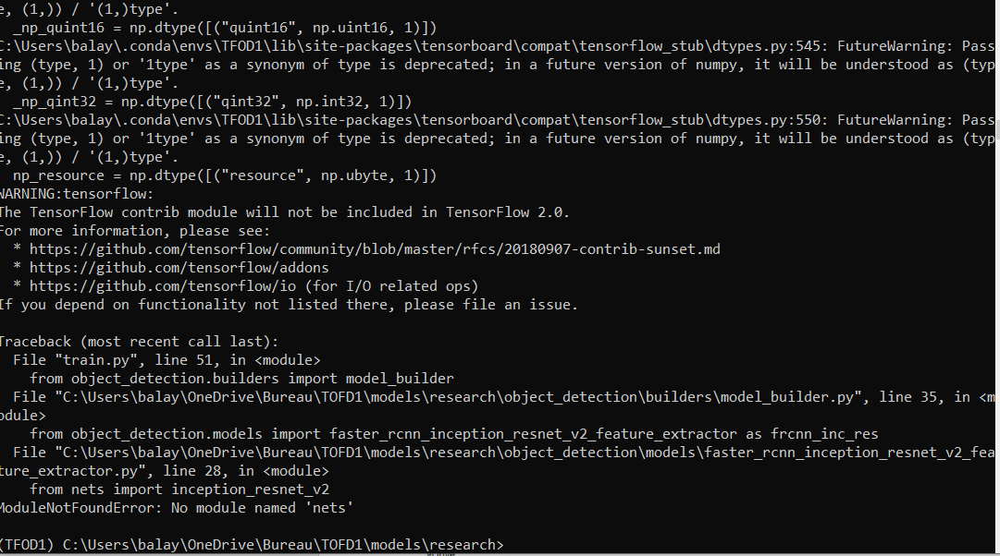

Copy and paste in research

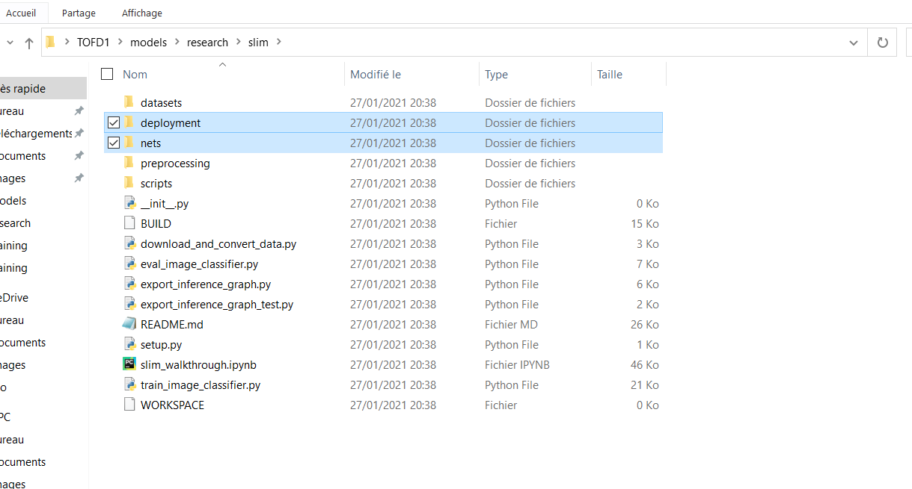

Before start training should have only two files now good to go

At least run 2000 steps to get something
